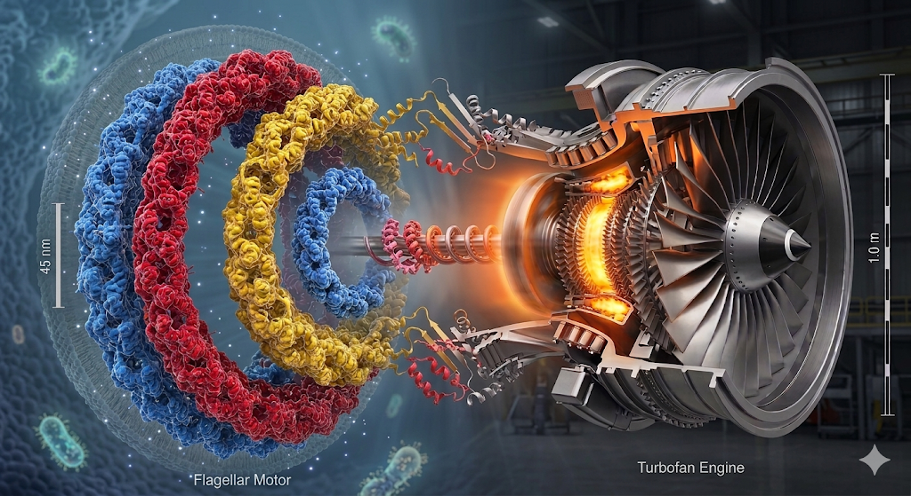

<p align="center">
  
</p>

<h1 align="center">CrossGen — Agent Skill</h1>

<p align="center">
  <strong>A Claude Skill for generating genuinely novel solutions to hard problems</strong><br>
  by structurally mapping mechanisms from distant domains —<br>
  biology, physics, ecology, the arts — not surface-level brainstorming.
</p>

<p align="center">
  <a href="#install-on-skillssh">Install</a> · <a href="#what-it-does">What it does</a> · <a href="#how-it-works">How it works</a> · <a href="#example">Example</a>
</p>

---

<p align="center">
  
</p>

<p align="center">
  <em>Editable source: <a href="assets/crossgen-pipeline.excalidraw">assets/crossgen-pipeline.excalidraw</a> — drag-and-drop into <a href="https://excalidraw.com">excalidraw.com</a></em>
</p>

---

## What it does

You give Claude a hard problem. CrossGen runs a **9-stage analogical-reasoning pipeline** that:

1. **Reformulates** the problem 5 different ways (inversion, constraint-relaxation, abstraction, provocation, first-principles) and explores 3 in parallel.
2. **Decomposes** each reframing into functions, constraints, contradictions, causal chains, and Meadows-level leverage points.
3. **Abstracts** through 4 simultaneous lenses: SAPPhIRE (scientific principles), Biologize (biomimicry), WordTree (semantic expansion), TRIZ (40 inventive principles + contradiction matrix).
4. **Expands** to 6–8 high-distance candidate domains across biology, physics, ecology, arts, earth sciences.
5. **Mines** each domain for a *specific* mechanism, then maps it to the target using Gentner's Structure-Mapping Theory — relations, not surface features. Five+ one-to-one mappings, connected causal chains, mandatory "where it breaks" with ≥3 weak spots.
6. **Synthesizes** each analogy into a concrete solution with numbered implementation steps, candidate inferences, **testable falsifiable predictions**, and research pointers.
7. **Verifies** each solution against existing work; pushes weak ones toward genuine novelty.
8. **Evaluates** on six calibrated dimensions (novelty, verified-novelty, surprise, feasibility, structural depth, actionability) with a same-domain penalty.
9. **Evolves** the top ideas through mutation (mechanism-swap, scale-shift, constraint-flip, domain-blend), recombination, and critique-and-strengthen.

The output is a ranked list of solutions with mechanism, scores, numbered concrete steps, testable predictions, honest failure modes, and academic-search pointers.

## What makes it different from "ask Claude to brainstorm"

- **Map relations, not surface features.** "Both have networks" is banned. Every mapping must trace HOW the source mechanism operates step-by-step against the target's causal chain.
- **"Where it breaks" is mandatory.** Every analogy must list ≥3 specific weak spots. Every concrete step must explicitly address one. Inspiration-porn analogies don't ship.
- **Testable predictions are non-negotiable.** Every solution outputs ≥2 falsifiable predictions with quantitative thresholds — the most valuable artifact of the entire pipeline.
- **TRIZ is deterministic.** The 40 principles and contradiction matrix are looked up, not hallucinated.
- **40 universal principles × 42 curated domains** are bundled as reference files Claude loads on demand — feedback loops, phase transitions, self-organization, catalysis, mycelial networks, stigmergy, allosteric regulation, capillary action, metamorphosis, quenching, trophic cascades, chirality, dormancy…
- **Honest scoring.** Same-domain penalty (×0.5). Calibrated rubric. Distribution sanity-check. Most scores belong in the 0.4–0.7 band.

## Install on skills.sh

1. **Upload this folder** as a Skill to [skills.sh](https://www.skills.sh/) — the entire repo (SKILL.md + references + examples + assets) is the skill package.
2. Once installed, Claude will trigger it automatically when you ask things like:
   - "How can we solve X?" (where X is a hard problem with trade-offs)
   - "Give me a creative approach to Y"
   - "Use biomimicry / TRIZ / lateral thinking on Z"
   - "Find non-obvious solutions to W"
3. You can also invoke explicitly: **/crossgen "<your problem>"**.

Or test it locally:

```bash
git clone https://github.com/<your-user>/crossgen-skill
cd crossgen-skill
# In Claude Code, point to this directory as a local skill
```

## How it works (file layout)

```
crossgen-skill/
├── SKILL.md                        ← entry point Claude reads (frontmatter + workflow)
├── references/
│   ├── structure-mapping.md        Gentner's theory operationalized — banned vs required patterns
│   ├── prompts.md                  Verbatim stage prompts (each of the 9 stages)
│   ├── universal-principles.md     40 cross-domain principles, tagged with domains
│   ├── domain-catalog.md           42 candidate domains across 8 categories
│   ├── triz.md                     40 TRIZ inventive principles + contradiction matrix
│   ├── scoring-rubric.md           Calibrated scoring with examples
│   └── output-template.md          Final report format
├── examples/
│   └── extreme-heat-cities.md      Abridged real run — top 5 solutions, quality bar
├── assets/
│   └── banner.png
├── LICENSE                         MIT
└── README.md                       this file
```

Reference files are loaded **progressively** — Claude only reads them when relevant (e.g., `structure-mapping.md` before Stage 4 if rusty on Gentner; `triz.md` during Stage 2d).

## Example

Problem: *"How can cities remain functional when extreme heat events exceed 50°C for weeks?"*

Top solution (score 0.77, distilled): **Termite mound architecture + Nitinol shape-memory-alloy passive actuators.** Replace electric AC micro-pumps with SMA wire loops that mechanically dilate channels above 35°C. The system is anti-fragile — the worse the heat event, the stronger the actuating force — and the natural ±0.5°C tolerance in production Nitinol provides ±18-minute desynchronization across a 500-building precinct without any firmware, compliance, or governance layer.

Testable prediction: *Thermosiphon circulation velocity in a 1.8m vertical loop scales as v ∝ (ΔT)^0.5 with coefficient ~0.04 m/s·K^−0.5 — predicting v ≈ 0.19 m/s at ΔT = 20°C, sufficient to maintain ≥60 W/m² discharge flux pumpless.*

Full example: [examples/extreme-heat-cities.md](examples/extreme-heat-cities.md). The original Python pipeline's full 40-solution output is in the source repo.

## When NOT to use this skill

- Factual lookups
- Code generation
- Summarization
- Questions where the "creative" framing is itself the wrong move (regulatory compliance, security incident response, hard-deadline patch fixes)

If you want one off-the-cuff novel idea, regular Claude works fine. CrossGen earns its compute on problems where **trade-offs are sharp, conventional answers are exhausted, and you need rigor — not just inspiration.**

## Lineage

This skill is the distilled methodology from the [CrossGen Python pipeline](https://github.com/mohamedAtoui/Gen-Ideas-differently) (~3K lines of Python orchestrating Claude across 9 stages with quality gates, parallel paths, deterministic TRIZ lookup, and automatic novelty verification). The Python version produces machine-readable JSON; this Skill version produces equivalent reasoning natively inside Claude — no API plumbing required.

The intellectual grounding:

- **Gentner, D. (1983)** — *Structure-Mapping: A Theoretical Framework for Analogy.* Cognitive Science 7(2).
- **Altshuller, G. (1984)** — *Creativity as an Exact Science.* TRIZ foundational text.
- **de Bono, E. (1970)** — *Lateral Thinking.*
- **Meadows, D. (1999)** — *Leverage Points: Places to Intervene in a System.*
- **Benyus, J. (1997)** — *Biomimicry: Innovation Inspired by Nature.*
- **Hofstadter, D. & Sander, E. (2013)** — *Surfaces and Essences.*

## License

MIT
